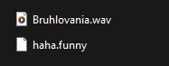
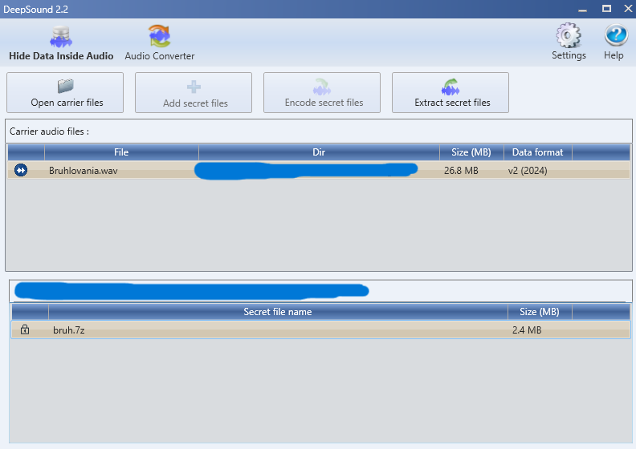
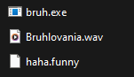
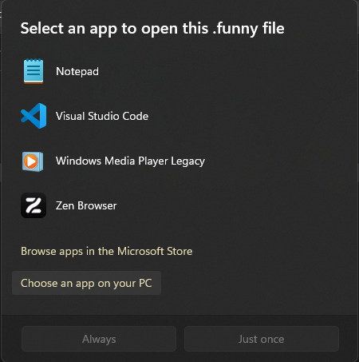
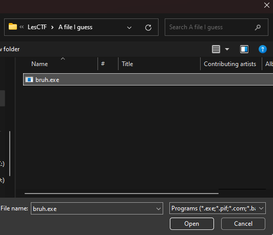
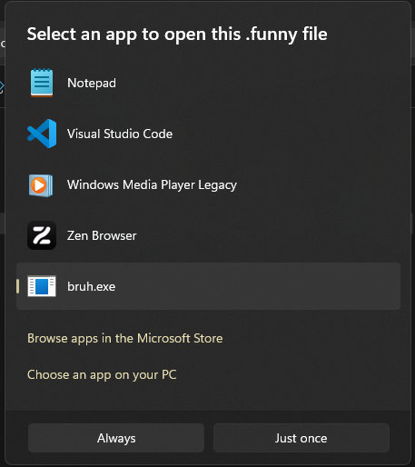
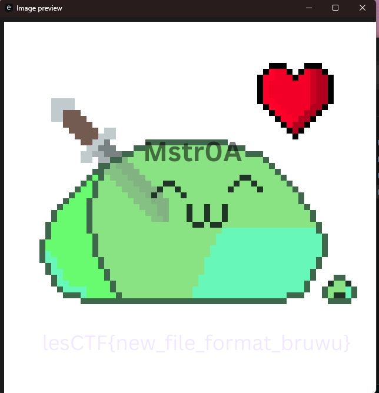

# A file I guess (Write-Up)
## Starting Files
You start with the following files: 
  

# Solving steps
1. You need the [DeepSound](https://github.com/Jpinsoft/DeepSound) tool for this question  
 

2. Once you have DeepSound installed you have to open the "Bruhlovania.wav" with it, once you do youll see this  
  
 

3. You have to click "Extract secret file" and then you get a file called bruh.7z, extract it and you'll get a file called "bruh.exe" (make sure to have [7zip](https://www.7-zip.org/) installed)  
<b>Note: Windows might flag it as a Virus even though it's not, the file is safe and the source code can be found [here](https://github.com/face-hh/bruh) (Shout-out to FaceDev) </b>  
 

4. After that you'll be left with these files  
  
Now you have to double click the "haha.funny" file  
 

5. When you double click it the following window will show up  
  
Click on "Choose an app on your PC"  
 

6. Navigate to the location where you stored "bruh.exe" and select it  
  
 

7. Finally make sure to click "Always" (MAKE SURE TO PICK ALWAYS AS JUST ONCE WILL NOT WORK)  
  
 

8. Finally double click the "haha.funny" file again and this time it should open an image (art made by me)  
  